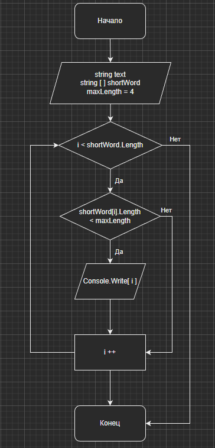

# Итоговая проверочная работа #

## Задание: ##

Написать программу, которая из имеющегося массива строк формирует массив из строк, длина которых меньше либо равна 3 символа. Первоначальный массив можно ввести с клавиатуры, либо задать на старте выполнения алгоритма. При решении не рекомендуется пользоваться коллекциями, лучше обойтись исключительно массивами.

## Блок-схема алгоритма: ##

## Программа : ##

Чтобы запустить программу перейдите в папку Algoritm и запустите файл Program.cs через терминал следующей командой:

    dotnet run

Введите любые данные через пробел, без запятых.

Программа из введеных Вами данных отберет лишь те, длина которых не более 3 символов.